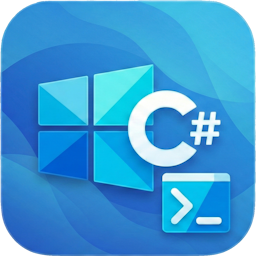

# WinDev Helper - A WinUI Extension for VS Code

[](https://marketplace.visualstudio.com/items?itemName=alvinashcraft.windev-helper)
[](https://opensource.org/licenses/MIT)

The **WinDev Helper** extension gives you the tools you need to build beautiful, performant, native Windows apps with WinUI 3 and the Windows App SDK. Built on top of the C# and C# Dev Kit extensions, it supercharges your .NET development with powerful IntelliSense, an intuitive Solution Explorer, package management, and more.

This extension leverages **winapp**, the Windows App Development CLI, to provide a seamless development experience for WinUI apps in VS Code.



## Features

### 🚀 Debugging & Running

- **Hit F5 to debug your app** on Windows
- Debug your WinUI app on any supported Windows device
- Run your app without debugging
- Write your WinUI C# and XAML anywhere VS Code runs

### 🔨 Build & Configuration

- Easily change Debug/Release build configurations
- Switch between x86, x64, and ARM64 platforms
- Build, rebuild, and clean projects from the command palette
- Status bar indicators for current build configuration and platform

### 📦 Packaging & Deployment

- Create and sign MSIX packages
- Generate development certificates
- Install certificates for testing
- Create debug identities for your apps

### 📝 Project & Item Templates

- Create new WinUI 3 projects with optional MVVM support
- Create WinUI class libraries
- Add new Pages, Windows, and User Controls to your project
- **Automatic MVVM setup** - Global usings for CommunityToolkit.Mvvm are automatically added when creating views
- Powered by [WinUI Templates](https://github.com/egvijayanand/winui-templates)

### 🛠️ App Manifest Management

- Generate and manage AppxManifest.xml files
- Open and edit your app manifest directly

### 📚 C# Dev Kit Integration

- Leverage all features of C# Dev Kit including:
  - Solution Explorer
  - Test Explorer
  - Code navigation and refactoring
  - Roslyn-powered language features

## Requirements

### Required Extensions

This extension requires the following VS Code extensions:

- [C#](https://marketplace.visualstudio.com/items?itemName=ms-dotnettools.csharp)
- [C# Dev Kit](https://marketplace.visualstudio.com/items?itemName=ms-dotnettools.csdevkit)

### Required Tools

- **.NET 8 SDK** or later - [Download](https://dotnet.microsoft.com/download)
- **Windows App SDK** - Automatically referenced in WinUI projects
- **Windows App Development CLI (winapp)** - [Learn more](https://github.com/microsoft/WinAppCli)
- **WinUI Templates** - Install with: `dotnet new install VijayAnand.WinUITemplates`

### System Requirements

- **Windows 10** version 1809 (build 17763) or later
- **Windows 11** (recommended)
- **Visual Studio Code** 1.108.1 or later

## Getting Started

### 1. Install Prerequisites

```bash
# Install .NET 8 SDK (if not already installed)
winget install Microsoft.DotNet.SDK.8

# Install WinUI Templates
dotnet new install VijayAnand.WinUITemplates

# Install Windows App Development CLI
winget install Microsoft.WinAppCli
```

### 2. Create a New Project

1. Open the Command Palette (`Ctrl+Shift+P`)
2. Run **WinUI: Create WinUI Project**
3. Enter your project name
4. Choose whether to include MVVM support
5. Select the target folder

Or use the command line:

```bash
# Create a basic WinUI app
dotnet new winui -n MyApp

# Create a WinUI app with MVVM
dotnet new winui -n MyApp -mvvm

# Create a WinUI library
dotnet new winuilib -n MyLib
```

### 3. Open and Build

1. Open your project folder in VS Code
2. Press `Ctrl+Shift+B` to build
3. Press `F5` to debug

## Commands

| Command | Description |
|---------|-------------|
| `WinUI: Create WinUI Project` | Create a new WinUI 3 application |
| `WinUI: Create WinUI Library` | Create a new WinUI class library |
| `WinUI: Add New Page` | Add a new XAML page to your project |
| `WinUI: Add New User Control` | Add a new user control |
| `WinUI: Add New Window` | Add a new window |
| `WinUI: Build Project` | Build the current project |
| `WinUI: Rebuild Project` | Clean and rebuild the project |
| `WinUI: Clean Project` | Clean build outputs |
| `WinUI: Debug Project` | Start debugging (F5) |
| `WinUI: Run Without Debugging` | Run without debugger |
| `WinUI: Create MSIX Package` | Create an MSIX package |
| `WinUI: Sign Package` | Sign an MSIX package or executable |
| `WinUI: Generate Development Certificate` | Create a dev certificate |
| `WinUI: Install Certificate` | Install a certificate |
| `WinUI: Create Debug Identity` | Add temporary app identity |
| `WinUI: Generate App Manifest` | Generate AppxManifest.xml |
| `WinUI: Open App Manifest` | Open the manifest file |
| `WinUI: Restore Packages` | Restore NuGet packages |
| `WinUI: Update Packages` | Update packages to latest |
| `WinUI: Select Build Configuration` | Switch Debug/Release |
| `WinUI: Select Target Platform` | Switch x86/x64/ARM64 |
| `WinUI: Install WinUI Templates` | Install dotnet templates |
| `WinUI: Check WinApp CLI Installation` | Verify CLI is installed |

## Extension Settings

This extension contributes the following settings:

| Setting | Type | Default | Description |
|---------|------|---------|-------------|
| `windevHelper.defaultConfiguration` | string | `Debug` | Default build configuration |
| `windevHelper.defaultPlatform` | string | `x64` | Default target platform |
| `windevHelper.winAppCliPath` | string | `""` | Path to winapp CLI (leave empty for PATH) |
| `windevHelper.autoRestoreOnOpen` | boolean | `true` | Auto-restore packages on project open |
| `windevHelper.showStatusBarItems` | boolean | `true` | Show config/platform in status bar |
| `windevHelper.certificatePath` | string | `""` | Default certificate path for signing |

## Keyboard Shortcuts

| Shortcut | Command |
|----------|---------|
| `F5` | Debug Project |
| `Ctrl+Shift+B` | Build Project |

## Windows App Development CLI

This extension integrates with the **Windows App Development CLI (winapp)**, which provides commands for:

### Setup Commands

- `winapp init` - Initialize project with Windows SDK and App SDK
- `winapp restore` - Restore packages and dependencies
- `winapp update` - Update packages to latest versions

### App Identity & Debugging

- `winapp package` - Create MSIX packages from directories
- `winapp create-debug-identity` - Add temporary app identity for debugging
- `winapp manifest` - Generate and manage AppxManifest.xml files

### Certificates & Signing

- `winapp cert` - Generate and install development certificates
- `winapp sign` - Sign MSIX packages and executables

### Development Tools

- `winapp tool` - Access Windows SDK tools
- `winapp get-winapp-path` - Get paths to installed SDK components

Learn more at [github.com/microsoft/WinAppCli](https://github.com/microsoft/WinAppCli).

## WinUI Project Structure

A typical WinUI 3 packaged app project includes:

```
MyApp/
├── Assets/
│   ├── LockScreenLogo.scale-200.png
│   ├── SplashScreen.scale-200.png
│   ├── Square150x150Logo.scale-200.png
│   ├── Square44x44Logo.scale-200.png
│   ├── StoreLogo.png
│   └── Wide310x150Logo.scale-200.png
├── Properties/
│   └── launchSettings.json
├── App.xaml
├── App.xaml.cs
├── MainWindow.xaml
├── MainWindow.xaml.cs
├── Package.appxmanifest
├── app.manifest
└── MyApp.csproj
```

## Known Issues

- XAML IntelliSense and Hot Reload are planned for future releases
- Some advanced debugging scenarios may require Visual Studio

## Contributing

Contributions are welcome! Please see our [Contributing Guide](docs/CONTRIBUTING.md) for details.

## Roadmap

### v1.0 (Current)

- ✅ C#/.NET WinUI 3 project support
- ✅ Debug and run support
- ✅ Build configuration management
- ✅ MSIX packaging and signing
- ✅ Project and item templates
- ✅ App manifest management

### Future Releases

- 🔄 XAML syntax highlighting and IntelliSense
- 🔄 XAML Hot Reload support
- 🔄 C++ WinUI project support
- 🔄 Additional project types (WinUI with WCT, Uno Platform)

## Resources

- [Windows App SDK Documentation](https://learn.microsoft.com/windows/apps/windows-app-sdk/)
- [WinUI 3 Documentation](https://learn.microsoft.com/windows/apps/winui/winui3/)
- [WinUI Templates on GitHub](https://github.com/egvijayanand/winui-templates)
- [Windows App Development CLI](https://github.com/microsoft/WinAppCli)
- [.NET CLI Documentation](https://learn.microsoft.com/dotnet/core/tools/)

## Release Notes

### 1.0.0

Initial release of WinDev Helper:

- Full debugging support for WinUI 3 apps
- Build configuration and platform management
- MSIX packaging and signing integration
- Project and item template support via WinUI Templates
- Windows App Development CLI integration
- C# Dev Kit integration

## License

This extension is licensed under the [MIT License](LICENSE).

---

**Enjoy building Windows apps with WinDev Helper!** 🚀
