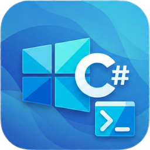

# WinDev Helper - A WinUI editor extension

[](https://marketplace.visualstudio.com/items?itemName=alvinashcraft.windev-helper)
[](https://open-vsx.org/extension/alvinashcraft/windev-helper)
[](https://opensource.org/licenses/MIT)

The **WinDev Helper** extension gives you the tools you need to build beautiful, performant, native Windows apps with WinUI 3 and the Windows App SDK. Built on top of the open-source C# extension (with optional [C# Dev Kit](https://aka.ms/vs/csdevkit/license) integration), it streamlines your .NET development with package management, MSIX packaging, debugging, manifest tooling, and more.

The extension is published to both the [Visual Studio Marketplace](https://marketplace.visualstudio.com/items?itemName=alvinashcraft.windev-helper) and the [Open VSX Registry](https://open-vsx.org/extension/alvinashcraft/windev-helper), so it works in VS Code, [VSCodium](https://vscodium.com/), [Cursor](https://cursor.com/), [Windsurf](https://codeium.com/windsurf), and other compatible editors.

This extension leverages **winapp**, the Windows App Development CLI, to provide a seamless development experience for WinUI apps in VS Code.



## Features

### XAML Designer

- **Editable visual design surface** - `.xaml` files open in a custom editor with an HTML/CSS approximation of WinUI controls on Windows, macOS, and Linux
- **Toolbox and drag-and-drop** - Search a curated WinUI control catalog, drag controls into layout containers, or double-click to add
- **Direct manipulation** - Select controls, move Canvas children, resize with eight handles, snap to a configurable grid, zoom from 25% to 200%, and delete with the keyboard
- **Embedded property grid** - Edit categorized WinUI and attached properties without leaving the designer; `{Binding}` and `{x:Bind}` expressions are preserved as read-only values
- **Two-way source synchronization** - Designer edits use VS Code document edits for native undo/redo and reject stale changes when the XAML source has changed concurrently
- **C# event generation** - Double-click a supported control to wire its default event and add the matching handler to the `.xaml.cs` file
- **Native Preview on Windows** - Switch to Preview mode to render with the bundled WinUI host, including project resources and theme support

The editable surface is cross-platform. Native Preview requires Windows and a bundled renderer matching the current architecture. Use **WinDev: Open XAML as Text** or the `</>` toolbar button whenever direct source editing is preferable. See the [XAML Designer guide](docs/xaml-designer.md).

### �🚀 Debugging & Running

- **Hit F5 to debug your app** on Windows
- Debug your WinUI app on any supported Windows device
- Run your app without debugging
- **MSIX packaged app support** - Automatic deployment and launch through package identity
- Write your WinUI C# and XAML anywhere VS Code runs

### 🔨 Build & Configuration

- Easily change Debug/Release build configurations
- Switch between x86, x64, and ARM64 platforms
- Build, rebuild, and clean projects from the command palette
- Status bar indicators for current build configuration and platform

### 📦 Packaging & Deployment

- Create and sign MSIX packages
- Generate development certificates with optional `.cer` public key export
- View certificate details (subject, issuer, validity)
- Install certificates for testing
- Create debug identities for your apps
- **Run as packaged app** - Launch apps as packaged apps from build output
- **Unregister dev packages** - Clean up sideloaded packages
- **Add app execution aliases** - Launch packaged apps by name from the terminal
- **Microsoft Store publishing** - Publish directly to the Microsoft Store from VS Code
- Check submission status and manage Store apps
- Create external catalogs for asset management

### 🧪 UI Automation

- **List windows** - Enumerate visible app windows
- **Inspect UI trees** - Walk the UI Automation tree of any running Windows app
- **Take screenshots** - Capture app window screenshots
- Enables automated testing and agentic workflows via `winapp ui`

### 📝 Project & Item Templates

- Create new WinUI 3 projects: **Blank**, **NavigationView**, **TabView**, **MVVM**, and **Unit Test** variants when using the official Microsoft template pack
- Create WinUI class libraries
- Add new **Pages**, **Windows**, **User Controls**, **Content Dialogs**, **Templated Controls**, and **Resource Dictionaries** to your project
- **Automatic MVVM setup** - Global usings for CommunityToolkit.Mvvm are automatically added when creating views
- All scaffolded projects support `dotnet run` out of the box for packaged apps via the bundled `Microsoft.Windows.SDK.BuildTools.WinApp` reference
- Supports both the [official Microsoft Windows App SDK templates](https://www.nuget.org/packages/Microsoft.WindowsAppSDK.WinUI.CSharp.Templates) and the [community WinUI Templates](https://github.com/egvijayanand/winui-templates); pick a preference via `windevHelper.templates.source`

### 🤖 WinUI Agent Skills

- **Install WinUI Agent + Skills Plugin** - One-click helper to set up the [WinUI agent plugin](https://devblogs.microsoft.com/ifdef-windows/build-native-windows-apps-with-ai-agents-for-winui-and-windows-app-sdk/) from the [microsoft/win-dev-skills](https://github.com/microsoft/win-dev-skills) marketplace for the GitHub Copilot CLI and Claude Code
- **Open WinUI Agent Skills Repository** - Jump to the win-dev-skills repo to browse the available agents and skills
- **Check Windows Dev Environment** - Diagnose your local toolchain (.NET SDK, WinApp CLI, WinUI templates, Developer Mode) with fix-up commands
- Pairs naturally with this extension: the agent scaffolds and iterates on your WinUI app while VS Code handles building, debugging, packaging, and signing

### ⚛️ Microsoft.UI.Reactor (Experimental)

- Light-touch support for the [Microsoft.UI.Reactor](https://microsoft.github.io/microsoft-ui-reactor/) declarative pure-C# UI framework for WinUI
- **Create Reactor App** - Scaffold a new app via `dotnet new reactorapp`
- **Reactor: Run Bootstrap** - Build the framework, `mur` CLI, and template from a local clone
- **Reactor: Open Documentation** and **Reactor: Install Agent Plugin** helpers
- Reactor projects (those referencing `Microsoft.UI.Reactor`) are detected automatically
- For live preview, use Microsoft's official [vscode-reactor](https://github.com/microsoft/microsoft-ui-reactor) extension

### 🛠️ App Manifest Management

- Generate and manage AppxManifest.xml files
- Open and edit your app manifest directly

### 📚 C# Dev Kit Integration

- Leverage all features of C# Dev Kit including:
  - Solution Explorer
  - Test Explorer
  - Code navigation and refactoring
  - Roslyn-powered language features

The XAML Designer and its C# event generation do not call C# Dev Kit APIs. C# Dev Kit remains an optional integration for Solution Explorer and related language tooling.

## Requirements

### Required Extensions

This extension requires the following VS Code extension:

- [C#](https://marketplace.visualstudio.com/items?itemName=ms-dotnettools.csharp) (open source, MIT)

### Recommended Extensions

- [C# Dev Kit](https://marketplace.visualstudio.com/items?itemName=ms-dotnettools.csdevkit) — enables Solution Explorer, Test Explorer, and the Solution Explorer context-menu entries used by `Add New Page`, `Add New User Control`, `Add New Window`, and `Add New ViewModel`. C# Dev Kit is proprietary and its [license](https://aka.ms/vs/csdevkit/license) restricts who may use it; install it only if your usage scenario qualifies. All build, debug, packaging, and template features in this extension work without C# Dev Kit — you'll just lose the Solution Explorer context-menu shortcuts (the same commands remain available from the Command Palette and the file Explorer).

### Required Tools

- **.NET 8 SDK** or later - [Download](https://dotnet.microsoft.com/download)
- **Windows App SDK** - Automatically referenced in WinUI projects
- **Windows App Development CLI (winapp)** - [Learn more](https://github.com/microsoft/WinAppCli)
- **WinUI Templates** - Install with `WinUI: Install WinUI Templates`, or directly:
  - Official: `dotnet new install Microsoft.WindowsAppSDK.WinUI.CSharp.Templates`
  - Community: `dotnet new install VijayAnand.WinUITemplates`

### System Requirements

- **Visual Studio Code** 1.108.1 or later
- **Windows, macOS, or Linux** for XAML visual editing and source workflows
- **Windows 10** version 1809 (build 17763) or later for WinUI build, run, debug, packaging, and native Preview
- **Windows 11** is recommended for full WinUI development

## Getting Started

### 1. Install Prerequisites

```bash
# Install .NET 8 SDK (if not already installed)
winget install Microsoft.DotNet.SDK.8

# Install WinUI Templates (pick one)
dotnet new install Microsoft.WindowsAppSDK.WinUI.CSharp.Templates
# or the community pack
dotnet new install VijayAnand.WinUITemplates

# Install Windows App Development CLI
winget install Microsoft.WinAppCli
```

### 2. Create a New Project

1. Open the Command Palette (`Ctrl+Shift+P`)
2. Run **WinUI: Create WinUI Project**
3. Enter your project name
4. Choose whether to include MVVM support
5. Select the target folder

Or use the command line:

```bash
# Create a basic WinUI app
dotnet new winui -n MyApp

# Create a NavigationView app
dotnet new winui-navview -n MyApp

# Create a TabView app
dotnet new winui-tabview -n MyApp

# Create a WinUI app with MVVM
dotnet new winui-mvvm -n MyApp

# Create a WinUI library
dotnet new winui-lib -n MyLib
```

### 3. Open and Build

1. Open your project folder in VS Code
2. Press `Ctrl+Shift+B` to build
3. Press `F5` to debug

## Commands

| Command | Description |
|---------|-------------|
| `WinUI: Create WinUI Project` | Create a new WinUI 3 application |
| `WinUI: Create WinUI Library` | Create a new WinUI class library |
| `WinUI: Add New Page` | Add a new XAML page to your project |
| `WinUI: Add New User Control` | Add a new user control |
| `WinUI: Add New Window` | Add a new window |
| `WinUI: Add New Content Dialog` | Add a new ContentDialog |
| `WinUI: Add New Templated Control` | Add a new templated (custom) control |
| `WinUI: Add New Resource Dictionary` | Add a new ResourceDictionary XAML file |
| `WinDev: Open XAML Designer` | Open the editable visual designer for a XAML file |
| `WinDev: Open XAML as Text` | Reopen the active designer document as source text |
| `WinUI: Build Project` | Build the current project |
| `WinUI: Rebuild Project` | Clean and rebuild the project |
| `WinUI: Clean Project` | Clean build outputs |
| `WinUI: Debug Project` | Start debugging (F5) |
| `WinUI: Run Without Debugging` | Run without debugger |
| `WinUI: Create MSIX Package` | Create an MSIX package |
| `WinUI: Sign Package` | Sign an MSIX package or executable |
| `WinUI: Generate Development Certificate` | Create a dev certificate |
| `WinUI: View Certificate Info` | Inspect PFX certificate details |
| `WinUI: Install Certificate` | Install a certificate |
| `WinUI: Create Debug Identity` | Add temporary app identity |
| `WinUI: Generate App Manifest` | Generate AppxManifest.xml |
| `WinUI: Open App Manifest` | Open the manifest file |
| `WinUI: Restore Packages` | Restore NuGet packages |
| `WinUI: Update Packages` | Update packages to latest |
| `WinUI: Select Build Configuration` | Switch Debug/Release |
| `WinUI: Select Target Platform` | Switch x86/x64/ARM64 |
| `WinUI: Install WinUI Templates` | Install dotnet templates |
| `WinUI: Install WinUI Agent + Skills Plugin` | Install the WinUI agent plugin (win-dev-skills) for the GitHub Copilot CLI |
| `WinUI: Open WinUI Agent Skills Repository` | Open the microsoft/win-dev-skills repo |
| `WinUI: Check Windows Dev Environment` | Diagnose the local WinUI toolchain |
| `WinUI: Create Reactor App` | Scaffold a Microsoft.UI.Reactor app |
| `WinUI: Reactor: Run Bootstrap` | Build the Reactor framework and template from a local clone |
| `WinUI: Reactor: Open Documentation` | Open the Reactor docs |
| `WinUI: Reactor: Install Agent Plugin` | Install the Reactor agent plugin |
| `WinUI: Check WinApp CLI Installation` | Verify CLI is installed |
| `WinDev: Run as Packaged App` | Launch app as a packaged app |
| `WinDev: Unregister Dev Package` | Remove a sideloaded dev package |
| `WinDev: Add App Execution Alias` | Add launch alias to manifest |
| `WinDev: UI: List Windows` | List visible app windows |
| `WinDev: UI: Inspect App` | Inspect UI Automation tree |
| `WinDev: UI: Take Screenshot` | Capture app window screenshot |
| `WinDev: Update Manifest Assets` | Auto-generate app icon assets from a single source image |
| `WinDev: Run SDK Tool` | Run `makeappx`, `signtool`, `mt`, or `makepri` via `winapp tool` |
| `WinDev: Get WinApp Path` | Show paths to installed Windows SDK components |
| `WinDev: Configure WinApp Debug & Tasks` | Scaffold `.vscode/launch.json` and `.vscode/tasks.json` for the `winapp` debug type |

## Extension Settings

This extension contributes the following settings:

| Setting | Type | Default | Description |
|---------|------|---------|-------------|
| `windevHelper.defaultConfiguration` | string | `Debug` | Default build configuration |
| `windevHelper.defaultPlatform` | string | `x64` | Default target platform |
| `windevHelper.winAppCliPath` | string | `""` | Path to winapp CLI (leave empty for PATH) |
| `windevHelper.autoRestoreOnOpen` | boolean | `true` | Auto-restore packages on project open |
| `windevHelper.showStatusBarItems` | boolean | `true` | Show config/platform in status bar |
| `windevHelper.certificatePath` | string | `""` | Default certificate path for signing |
| `windevHelper.designer.gridSize` | number | `8` | Snap grid size for movement and resizing |
| `windevHelper.designer.snapToGrid` | boolean | `true` | Initial designer snap state |
| `windevHelper.preview.theme` | string | `auto` | Preview theme: auto, light, dark |
| `windevHelper.preview.width` | number | `800` | Native Preview width |
| `windevHelper.preview.height` | number | `600` | Native Preview height |
| `windevHelper.templates.source` | string | `auto` | Template package preference: `auto`, `official`, or `community` |
| `windevHelper.templates.allowPrerelease` | boolean | `true` | Install prerelease versions of the official Microsoft template pack |

## Keyboard Shortcuts

| Shortcut | Command |
|----------|---------|
| `F5` | Debug Project |
| `Ctrl+Shift+B` | Build Project |
| `Ctrl+Shift+V` | Open XAML Designer |

## Windows App Development CLI

This extension integrates with the **Windows App Development CLI (winapp)**, which provides commands for:

### Setup Commands

- `winapp init` - Initialize project with Windows SDK and App SDK
- `winapp restore` - Restore packages and dependencies
- `winapp update` - Update packages to latest versions

### App Identity & Debugging

- `winapp package` - Create MSIX packages from directories
- `winapp create-debug-identity` - Add temporary app identity for debugging
- `winapp manifest` - Generate and manage AppxManifest.xml files

### Certificates & Signing

- `winapp cert generate` - Generate development certificates
- `winapp cert info` - View certificate details (subject, issuer, validity)
- `winapp cert install` - Install development certificates
- `winapp sign` - Sign MSIX packages and executables

### Development Tools

- `winapp tool` - Access Windows SDK tools
- `winapp get-winapp-path` - Get paths to installed SDK components

### Run & Automation (v0.3.0+)

- `winapp run` - Run a build output as a packaged app (v0.3.1+: forward application args after `--`)
- `winapp unregister` - Remove a sideloaded dev package
- `winapp manifest add-alias` - Add an app execution alias to the manifest
- `winapp ui` - UI Automation: list windows, inspect trees, click, screenshot, and more
- `winapp complete` - Set up shell tab completion

Learn more at [github.com/microsoft/WinAppCli](https://github.com/microsoft/WinAppCli).

## WinUI Project Structure

A typical WinUI 3 packaged app project includes:

```
MyApp/
├── Assets/
│   ├── LockScreenLogo.scale-200.png
│   ├── SplashScreen.scale-200.png
│   ├── Square150x150Logo.scale-200.png
│   ├── Square44x44Logo.scale-200.png
│   ├── StoreLogo.png
│   └── Wide310x150Logo.scale-200.png
├── Properties/
│   └── launchSettings.json
├── App.xaml
├── App.xaml.cs
├── MainWindow.xaml
├── MainWindow.xaml.cs
├── Package.appxmanifest
├── app.manifest
└── MyApp.csproj
```

## Known Issues

- **MSIX Packaged Apps**: Debugger attachment is not yet supported for packaged apps. They launch without a debugger; set `<WindowsPackageType>None</WindowsPackageType>` in your .csproj for full F5 debug support
- **Designer fidelity**: The editable canvas approximates WinUI in HTML/CSS; use Windows native Preview to verify final rendering
- **Custom controls**: Third-party controls appear as generic placeholders and do not receive full metadata-driven property editors
- **Layout editing**: Direct movement currently applies to Canvas children; use attached properties for Grid and RelativePanel placement
- XAML IntelliSense and Hot Reload are planned for future releases
- Some advanced debugging scenarios may require Visual Studio
- Native Preview requires Windows; visual XAML editing remains available on macOS and Linux

## Contributing

Contributions are welcome! Please see our [Contributing Guide](docs/CONTRIBUTING.md) for details.

## Roadmap

### v1.0 (Stable)

- ✅ C#/.NET WinUI 3 project support
- ✅ Debug and run support
- ✅ Build configuration management
- ✅ MSIX packaging and signing
- ✅ Project and item templates
- ✅ App manifest management

### v2.x (Preview)

- ✅ Native XAML preview using WinUI 3 rendering engine
- ✅ Click-to-navigate from preview to XAML source
- ✅ Bidirectional cursor/selection sync
- ✅ Project resource support (App.xaml, merged dictionaries)
- ✅ Data binding placeholder visualization
- ✅ XAML Properties pane with full control metadata (~85 types)
- ✅ XAML preprocessor for third-party control tolerance
- ✅ Expanded HTML fallback renderer coverage (69 controls)
- ✅ MSIX packaged app deployment and launch
- ✅ Improved debugging for packaged and unpackaged apps
- 🔄 Debugger attachment for MSIX-packaged apps
- 🔄 Improved element matching for complex layouts
- 🔄 DataTemplate and ItemsControl preview support

### v4.0

- ✅ Cross-platform editable XAML custom editor
- ✅ Searchable WinUI toolbox and drag-and-drop
- ✅ Selection, Canvas movement, eight-handle resizing, snapping, and zoom
- ✅ Embedded categorized property editing with binding preservation
- ✅ Optimistic two-way document synchronization
- ✅ C# default-event generation without C# Dev Kit APIs
- ✅ Integrated Windows-only native Preview mode

### Future Releases

- 🔄 XAML syntax highlighting and IntelliSense
- 🔄 XAML Hot Reload support
- 🔄 C++ WinUI project support
- 🔄 Additional project types (WinUI with WCT, Uno Platform)

## Resources

- [Windows App SDK Documentation](https://learn.microsoft.com/windows/apps/windows-app-sdk/)
- [WinUI 3 Documentation](https://learn.microsoft.com/windows/apps/winui/winui3/)
- [WinUI Templates on GitHub](https://github.com/egvijayanand/winui-templates)
- [Windows App Development CLI](https://github.com/microsoft/WinAppCli)
- [.NET CLI Documentation](https://learn.microsoft.com/dotnet/core/tools/)

## Release Notes

### 2.5.0 (Preview)

XAML Properties Pane, packaged app support, and preview robustness:

- **XAML Properties Pane** - Full property inspection with metadata for ~65 WinUI control types
- **MSIX Packaged App Support** - Deploy and launch packaged apps through their package identity
- **XAML Preprocessor** - Third-party controls handled gracefully with placeholder grids
- **Preview Performance** - Eliminated first-render timeout with pre-initialization
- **Debug Improvements** - Multi-path executable resolution for packaged/unpackaged apps

### 2.0.0 (Preview)

New native XAML preview feature:

- **Native XAML Preview** - Renders XAML using the actual WinUI 3 rendering engine
- **Click-to-navigate** - Click elements in the preview to jump to XAML source
- **Bidirectional sync** - Cursor position syncs between editor and preview
- **Project resources** - Loads App.xaml and merged resource dictionaries
- **Binding visualization** - Shows placeholder values for data bindings
- **Theme support** - Respects VS Code light/dark theme settings

### 1.0.0

Initial release of WinDev Helper:

- Full debugging support for WinUI 3 apps
- Build configuration and platform management
- MSIX packaging and signing integration
- Project and item template support via WinUI Templates
- Windows App Development CLI integration
- C# Dev Kit integration

## License

This extension is licensed under the [MIT License](LICENSE).

---

**Enjoy building Windows apps with WinDev Helper!** 🚀
